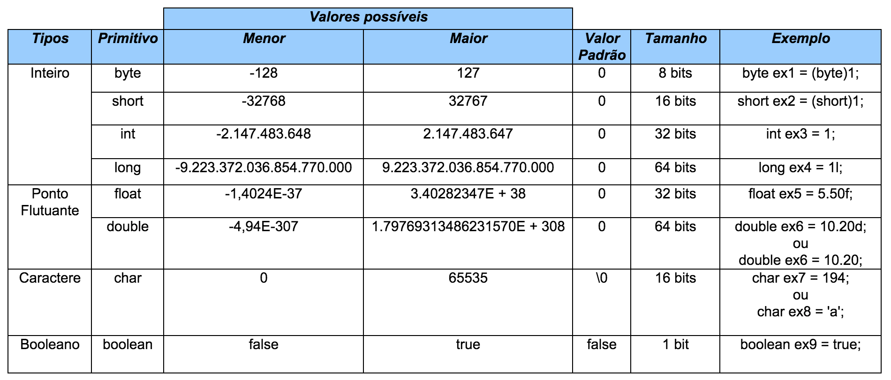

<h1>Sobre Variáveis</h1>

<h2>O que são variáveis</h2>

Uma variável é uma porção de memória utilizada para armazenar dados durante a execução dos programas

Uma explicação mais breve:

A variável é uma caixa de briquedos e os dados é o brinquedo. Cada brinquedo possui características como formas, cores e jeitos diferentes um dos outros. As características são os valores dos dados e os dados possuem um tipo que estabalece o que ele vai armazenar. 

<h3>Tipos de dados</h3>

<b>int: </b>Representa números inteiros

<b>float: </b>Representa um valor de ponto flutuante de precisão simples (números reais)

<b>char: </b>Representa um caractere

<b>double: </b>Representa um valor de ponto flutuante de precisão dupla

<b>boolean: </b>Representa valores verdadeiro ou falso

<b>long: </b>Representa um valor inteiro longo

<b>short: </b>Representa um valor inteiro curto

<b>byte: </b>Representa um valor inteiro de 8 bits

<h4>NÃO É UM TIPO DE DADO PRIMITIVO</h4>

<b>string: </b>Representa um conjunto de caracteres (palavras ou textos)

<h3>Declaração de variáveis</h3>

Uma variável possui: 

<ul>
<li>Nome (ou identificador)</li>
<li>Tipo</li>
<li>Valor</li>
<li>Endereço</li>
</ul>

<h4>Sintaxe</h4>

~~~
<tipo> <nome> = <valor inicial>;
~~~

Exemplos

~~~
int idade = 25;
double altura = 1.68;
char sexo = 'F';
~~~
